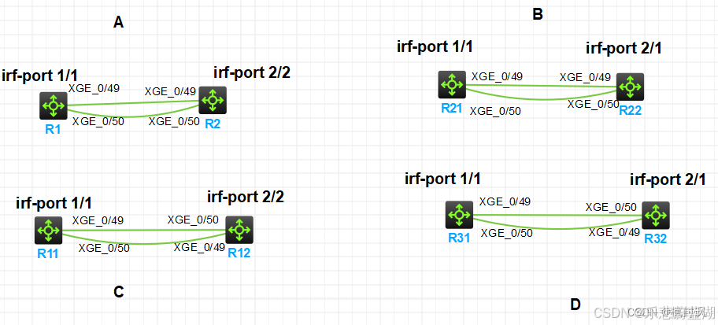

> 
堆叠(IRF)

 
图中是两台交换机堆叠的连接方式：其中：只有A和C是堆叠成功，B和D是错误的。

- <b>
堆叠理论
</b>

H3C的堆叠称为IRF（Intelligent Resilient Framework，智能弹性架构）

IRF中每台设备都称为成员设备。成员设备按照功能不同，分为两种角色：

主用设备（简称为主设备）：负责管理和控制整个IRF。

从属设备（简称为从设备）：处理业务、转发报文的同时作为主设备的备份设备运行。当主设备故障时，系统会自动从从设备中选举一个新的主设备接替原主设备工作。

IRF端口： 
一种专用于IRF成员设备之间进行连接的逻辑接口，每台成员设备上可以配置两个IRF端口，分别为IRF-Port1和IRF-Port2。它需要和物理端口绑定之后才能生效。  
在IRF模式下，IRF端口采用二维编号，分为IRF-Portn/1和IRF-Portn/2，其中n为设备的成员编号。  
MAD检测功能：
IRF链路故障会导致一个IRF变成多个新的IRF。这些IRF拥有相同的IP地址等三层配置，会引起地址冲突，导致故障在网络中扩大。为了提高系统的可用性，当IRF分裂时我们就需要一种机制，能够检测出网络中同时存在多个IRF，并进行相应的处理，尽量降低IRF分裂对业务的影响。  
它主要提供以下功能： 
(1)分裂检测
通过LACP（Link Aggregation Control Protocol，链路聚合控制协议）、BFD（Bidirectional Forwarding Detection，双向转发检测）、ARP（Address Resolution Protocol，地址解析协议）或者ND（Neighbor Discovery，邻居发现）来检测网络中是否存在多个IRF。 
(2)冲突处理
IRF分裂后，通过分裂检测机制IRF会检测到网络中存在其它处于正常工作状态的IRF。  
对于BFD MAD和LACP MAD检测，冲突处理方式为： 
a.比较两个IRF的健康状态，健康状态较好的IRF继续工作，其它IRF迁移到Recovery状态（即禁用状态）。IRF的健康状态可以通过display system health命令查看。 
b.如果健康检查结果相同，比较两个IRF中成员设备的数量：数量多的IRF继续正常工作，数量少的迁移到Recovery状态（即禁用状态）。 
c.如果成员数量相等，则主设备成员编号小的IRF继续正常工作，其它IRF迁移到Recovery状态。  
对于ARP MAD和ND MAD检测，冲突处理方式为： 
比较两个IRF的健康状态，健康状态较好的IRF继续工作，其它IRF迁移到Recovery状态（即禁用状态）。IRF的健康状态可以通过display system health命令查看。如果健康检查结果相同，则主设备成员编号小的IRF继续工作，其它IRF迁移到Recovery状态。  
(3)MAD故障恢复 
IRF链路故障导致IRF分裂，从而引起多Active冲突。因此修复故障的IRF链路，让冲突的IRF重新合并为一个IRF，就能恢复MAD故障。 
如果出现故障的是继续正常工作的IRF，则在进行MAD故障恢复前，可以通过命令行先启用Recovery状态的IRF，让它接替原IRF工作，以便保证业务尽量少受影响，再恢复MAD故障。 
如果在MAD故障恢复前，处于Recovery状态的IRF也出现了故障，则需要将故障IRF和故障链路都修复后，才能让冲突的IRF重新合并为一个IRF，恢复MAD故障。 

- <b>
堆叠注意：
</b>
①逻辑irf端口一定要交叉相连。(irf 1/1连2/2，2/1连3/2，3/1连4/2） 
②irf-port 1/1 分子是交换机的成员编号；分母才是区别逻辑端口irf 1还是 irf 2 
③交换机只有两个逻辑的irf端口；分别irf 1和 irf 2 
④两台交换机的成员编号不能相同 
⑤一般成员编号为1为主交换机，成员编号为2以及之后，都为备交换机 

- <b>
配置命令：
</b>
 - - 
SWA

|命令|注释|
|:-:|:-:|
system-view|进入配置模式|
irf member 1 priority 20|成员1优先级设置为20|
int range 端口A to 端口B|进入堆叠物理端口|
shutdown|关闭物理端口|
quit|退出端口模式|
irf-port 1/1|配置堆叠端口|
port group inter 端口A|将物理端口A划入堆叠端口|
port group inter 端口B|将物理端口B划入堆叠端口|
quit|退出端口模式|
int range hu 端口A to 端口B|进入堆叠物理端口|
undo shutdown|开启物理端口|
quit|退出端口模式|
save|保存配置|
irf-port-config active|激活堆叠逻辑端口|

 - - 
SWB

|命令|注释|
|:-:|:-:|
system-view|进入配置模式|
irf member 1 renumber 2|修改接口成员编号为2|
quit|退出配置模式|
save|保存配置|
reboot|重启设备|
system-view|进入配置模式|
irf member 2 prio 10|成员2优先级设置为10|
int range 端口A to 端口B|进入堆叠物理端口|
shutdown|关闭物理端口|
quit|退出端口模式|
irf-port 2/2|配置堆叠端口|
port group inter 端口A|将物理端口A划入堆叠端口|
port group inter 端口B|将物理端口B划入堆叠端口|
quit|退出端口模式|
int range hu 端口A to 端口B|进入堆叠物理端口|
undo shutdown|开启物理端口|
quit|退出端口模式|
save|保存配置|
irf-port-config active|激活堆叠逻辑端口| 

- <b>
查看堆叠配置
</b>

|命令|注释|
|:-:|:-:|
display irf|IRF信息|
display irf config|IRF成员配置信息|
display irf topology|IRF拓扑信息|