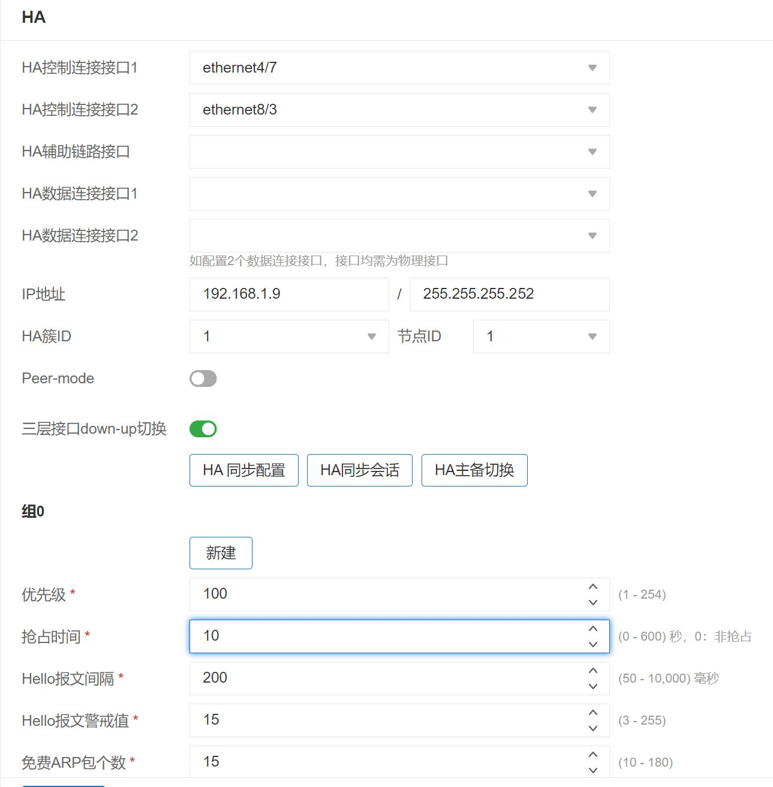
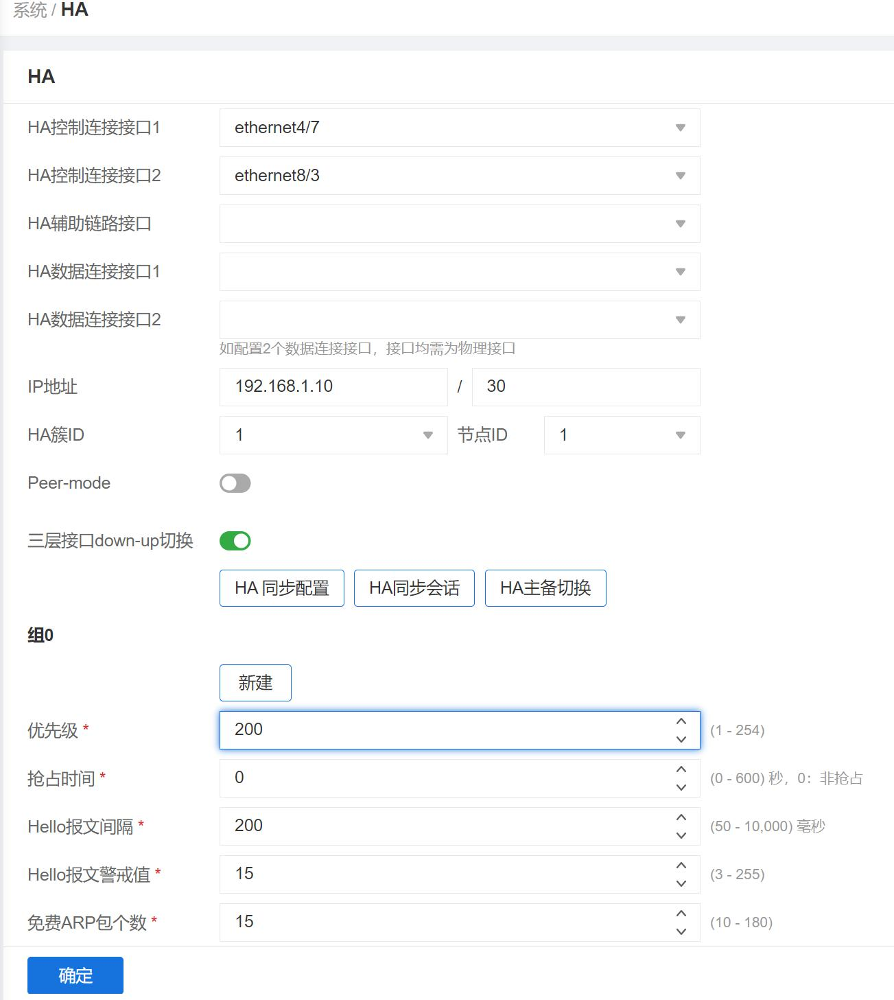
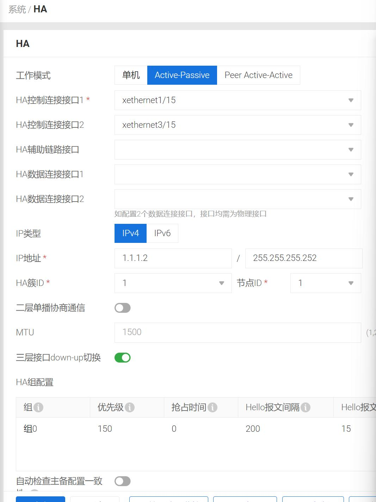
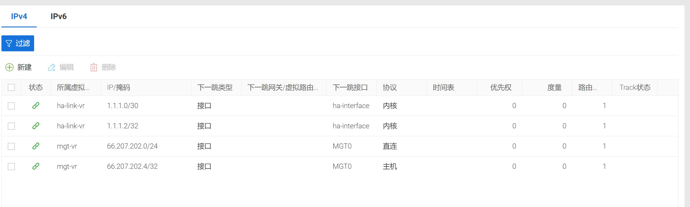

> 
HA

<h3>1、配置HA</h3>

主防火墙（双心跳）：  
  
备防火墙（双心跳）：  
  

<h3>2、关闭HA同步</h3>

|命令|注释|
|:-:|:-:|
interface MGT|进入MGT端口|
show this|查看MGT端口信息|
【interface MGT|MGT端口信息|
  zone  "mgt"|MGT区域|
  ip address 192.168.1.1 255.255.255.0|IP地址|
  manage ssh|SSH功能已开启|
  manage ping|PING功能已开启|
  manage snmp|SNMP功能已开启|
  manage https】|HTTPS功能已开启|
no ip add|删除接口IP|
no zone|安全域解绑|
local|接口配置Local，关闭HA同步|
zone mgt|绑定安全域|
ip add X.X.X.X/X|配置接口IP|

<h3>3、K9180注意事项</h3> 

  
  